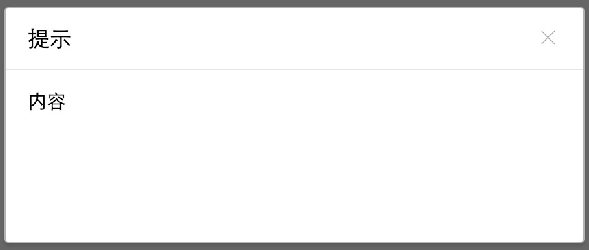

### 用途

含有遮罩层的对话框，用于模拟浏览器的alert、confirm等。

模态对话框通过遮罩层来阻止用户的其他行为。

### 分类

- 标准弹框 （标题、内容、底部）



- 非标准弹框 （内容）


它们的相同点是都有最外边的容器和关闭按钮。

标准弹框其实也可以隐藏标题和底部，但是非标准弹框更多的是需要支持自定义的布局（例如弹框里面有一个Tab），而标准在标题、内容、底部这几块布局上都做了限制。

### 依赖

因为右上角的关闭图标用到了webIcon，所以会依赖下面的css文件，这一块在将来会做处理。

```
<link rel="stylesheet" href="//at.alicdn.com/t/font_1475922891_4469836.css">
```

### API

基本用法：

```
new Dui.Modal(option)
```

option为json对象

| 参数        | 类型   |  默认值  |  描述 |
| ------   | --------  | ----  | -------- |
| option.type | string |   default  | 弹框类型，默认为标准弹窗。当需要支持非标准弹框，值为：custom  |
| option.className | string | 空 | 挂载到弹框上的类，通过它来自定义自己的class |
| option.mask | boolean | true | 是否显示蒙板 |
| option.closeClass | string | iconfont icon-shanchu5 | 关闭按钮的class，必须使用webIcon的类 |
| option.zIndex | int | 9999 | 最外层容器的z-index属性 |
| option.width | int/string |   420     |  弹框宽度，写法支持：160px 或者 160，当宽超过920时，会取920的宽度   |
| option.height | int/string  |   170   |  弹框高度，写法支持：160px 或者 160，当要求高度自适应时，值为auto，但它和宽度一样，有一个最大高度：580 |
| option.title | string |  提示  | 弹框标题，建议传单纯的文字。当值为空时，整个title不存在  |
| option.titleIconClass | string | 无 | 弹框标题图标的class，当有该class时，如`iconfont icon-sousuo1`，它就会显示在title中 |
| option.content | string | 内容 | 弹框内容，支持HTML |
| option.btnPos | string |   right     |  弹框底部按钮对齐方式，默认靠右对齐，取值：left/center/right  |
| option.ok | boolean/string |  false  |  当值为boolean时，表示是否显示确认按钮；当值为字符串时，显示确认按钮，并将它的按钮文本修改成该字符串   |
| option.cancel | boolean/string |  false  |  当值为boolean时，表示是否显示取消按钮；当值为字符串时，显示取消按钮，并将它的按钮文本修改成该字符串  |
| option.okFn | function |   无      |  显示确认按钮，触发确认的事件   |
| option.canceFn | function |   无     |  显示确认按钮，触发确认的事件  |
| option.close | boolean | true |  是否显示右上角的关闭按钮 |
| option.init | function |   无     |  弹框渲染完可能要做一些处理的事件，在事件中可以通过`this.dialogDom`取到弹框容器   |
| option.draggable | boolean | false | 是否可以拖拽对话框，默认为false |

支持的方法：

| 方法名   |  描述 |
| ------ | -------- |
| hide | 关闭弹窗 |

调用方式简单如下：

```
var dialog = new Dui.Modal({})
dialog.hide();
```

<mark>注：像init或者okFn函数中，可以通过调用this.hide()来关闭（销毁）弹窗</mark>

支持的事件：

事件通过$on来绑定，如：

```
var dialog = new Dui.Modal({})
dialog.$on("事件名", function(){})
```

| 事件名   |  描述 |
| ------ | -------- |
| close | 点击右上角关闭时触发的事件 |
| ok | 点击`确定`触发的事件 |
| cancel | 点击`取消`触发的事件 |
| destroy | 弹窗被销毁的时候，比如esc关闭、取消关闭、右上角关闭，触发该事件，通常用来解绑弹窗Content里面的事件 |
| dragStart | 当draggable为true时，开始拖拽的事件 |
| dragEnd | 当draggable为true时，结束拖拽的事件 |

------

### 高级用法（静态方法）

- Dui.Modal.alert(content[, title, close])

弹出一个alert对话框。

例：
```
Dui.Modal.alert("xxxx");
```

- Dui.Modal.confirm(content[, title, close])

弹出一个confirm对话框。它会返回一个Promise对象，因此如果在非chrome下要引用promise库才行，不然会报错

通常我们在点击`确认`后，想做一些事件，代码如下：

```
Dui.Modal.confirm("xxxx").then(function(){
    //todo something
});
```


