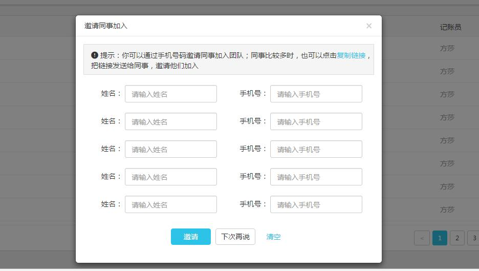
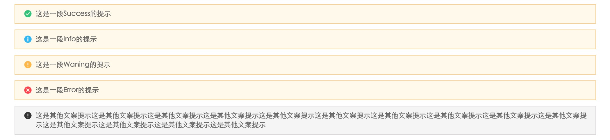
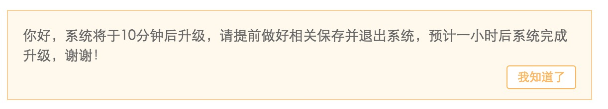
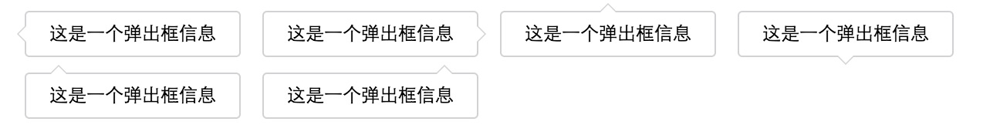
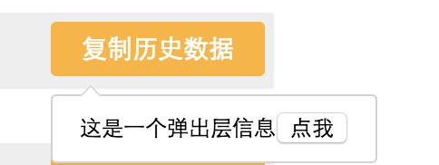
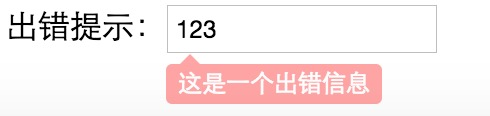

### 用途

提示框，通常用于鼠标hover。或者全局提示等。

### 分类

- 全局提示（带icon的，如success、error、info等）
- 全局提示（纯文字版，用于更新项目时，提示给用户的信息）
- tooltip（类似dom的title属性的功能）
- poptip（复杂的tooltip，如新浪微博头像，鼠标hover时，可以操作tip里面的内容，如关注、取消关注等）
- 表单元素显示错误信息

### 依赖

因为全局提示带icon的，用到了webIcon，所以需要依赖下面文件，这一块后期做优化处理

```
<link rel="stylesheet" href="//at.alicdn.com/t/font_rh9ogim4kcd0wwmi.css">
```

### 全局提示（带icon）

- 用于显示，如显示在弹框里面



于是就有下面的5种情况：



HTML的结构分别对应如下：

```
<div class="dui-tip-success">
     <i class="iconfont icon-zhengque1"></i>
     <p>这是一段Success的提示</p>
</div>
```

```
<div class="dui-tip-info">
     <i class="iconfont icon-yunxingyichangtishi-20150921"></i>
     <p>这是一段Info的提示</p>
</div>
```

```
<div class="dui-tip-warning">
    <i class="iconfont icon-tanhao"></i>
    <p>这是一段Waning的提示</p>
</div>
```

```
<div class="dui-tip-error">
    <i class="iconfont icon-cuowu-20160921"></i>
    <p>这是一段Error的提示</p>
</div>
```

```
<div class="dui-tip">
    <i class="iconfont icon-tanhao"></i>
    <p>这是其他文案提示这是其他文案提示这是其他文案提示这是其他文案提示这是其他文案提示这是其他文案提示这是其他文案提示这是其他文案提示这是其他文案提示这是其他文案提示这是其他文案提示这是其他文案提示这是其他文案提示这是其他文案提示</p>
</div>
```

- 用于交互，通常通过一段js脚本来全局提示一段信息

建议用法：

```
Dui.Tip.showHint(type, msg[,pos, time, callback])
```

| 参数        | 类型   |  默认值  |  描述 |
| ------   | --------  | ----  | -------- |
| type | string | 无 | 可选值：success / warn / info / error / other  |
| msg | string | 无 | 提示信息 |
| pos | string | top | 显示位置，可选值：top / middle |
| time | int | 2 | 提示框显示的时间，单位：秒，默认2s后，动画消失 |
| callback | function | 无 | 提示框消失后的回调处理 |

为了和之前写的API统一，Tip也提供了以下的方法：

```
//top显示success的信息
Dui.Tip.successInfo(msg[,time, callback]) 
//middle显示success的信息
Dui.Tip.middleSuccessInfo(msg[,time, callback]) 

//top显示warn的信息
Dui.Tip.warning(msg[,time, callback]) 
//middle显示warn的信息
Dui.Tip.middleWarning(msg[,time, callback]) 

//top显示other(default)的信息
Dui.Tip.otherInfo(msg[,time, callback]) 
//middle显示other(default)的信息
Dui.Tip.middleOtherInfo(msg[,time, callback]) 

//top显示info的信息
Dui.Tip.info(msg[,time, callback]) 
//middle显示info的信息
Dui.Tip.middleInfo(msg[,time, callback]) 

//top显示error的信息
Dui.Tip.error(msg[,time, callback]) 
//middle显示error的信息
Dui.Tip.middleSuccessInfo(msg[,time, callback])
```

### 全局提示（无文字版）



基本用法：

```
Dui.Tip.showUpdateMessage(msg);
```

| 参数        | 类型   |  默认值  |  描述 |
| ------   | --------  | ----  | -------- |
| msg | string | 无 | 要显示的文本信息 |

### tooltip

tooltip是通过鼠标hover显示的。它的箭头位置共有6种，对应：上、下、左、右、下左、下右。如下图：



基本用法：

```
Dui.Tip.tooltip(option)
```

option是一个json对象。

| 参数        | 类型   |  默认值  |  描述 |
| ------   | --------  | ----  | -------- |
| option.el | string/domElement | 空 | 移入的目标元素 |
| option.msg | string | 空 | 提示框内容 |
| option.pos | string | 空 | 箭头位置，可选值：t / b / l / r / bl / br |
| option.spacing | int | 5 | 距离目标元素的值 |

简单demo如下：

```
var t1 = Dui.Tip.tooltip({
    el: ".J_tip1",
    msg: "这是一个弹出层信息",
    pos: "l"
});
```

在SPA（单页面应用）中，有事件绑定，肯定要有事件解绑，所以我也提供了如下的方法来unbind mouse事件

```
t1.destroy();
```


### poptip

poptip是tooltip的升级版，它可以操作tip里面的内容。



基本用法：

```
Dui.Tip.poptip(option)
```

option是一个json对象。

| 参数        | 类型   |  默认值  |  描述 |
| ------   | --------  | ----  | -------- |
| option.el | string/domElement | 空 | 移入的目标元素 |
| option.msg | string | 空 | 提示框内容 |
| option.trigger | string | hover | 鼠标行为，可选值：hover / click |
| option.pos | string | 空 | 箭头位置，可选值：t / b / l / r / bl / br |
| option.spacing | int | 5 | 距离目标元素的值 |

简单demo如下：

```
var t5 = Dui.Tip.poptip({
    el: ".J_tip4",
    msg: '这是一个弹出层信息<button class="myButton">点我</button>',
    pos: "l",
    trigger: "click"
})

//操作tip内容里面的按钮
t5.tipDom.querySelector("button").onclick = function() {
    console.log(789);
    t5.hide();
}
```

事件解绑：

```
t5.destroy(function(){
    //onclick = null
})
```

### 表单元素的错误信息



基本用法：

```
Dui.Tip.showFormError(option)
```

option是一个json对象。

| 参数        | 类型   |  默认值  |  描述 |
| ------   | --------  | ----  | -------- |
| option.el | string/domElement | 空 | 移入的目标元素 |
| option.msg | string | 空 | 提示框内容 |
| option.pos | string | 空 | 箭头位置，可选值：t / b / l / r / bl / br |
| option.spacing | int | 0 | 距离目标元素的值 |

简单demo：

```
var t3 = Dui.Tip.showFormError({
    el: ".J_input",
    msg: "这是一个出错信息",
    pos: "bl"
})

t3.show();
```